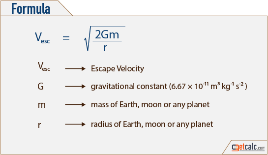

# Coding Challenge: Escape Velocity 

[Escape velocity](https://en.wikipedia.org/wiki/Escape_velocity) is the minimum speed needed for a free, non-propelled object to escape from the gravitational influence of a massive body, that is, to achieve an infinite distance from it. Escape velocity is a function of the mass of the body and distance to the center of mass of the body.

## Part I

## Part II
